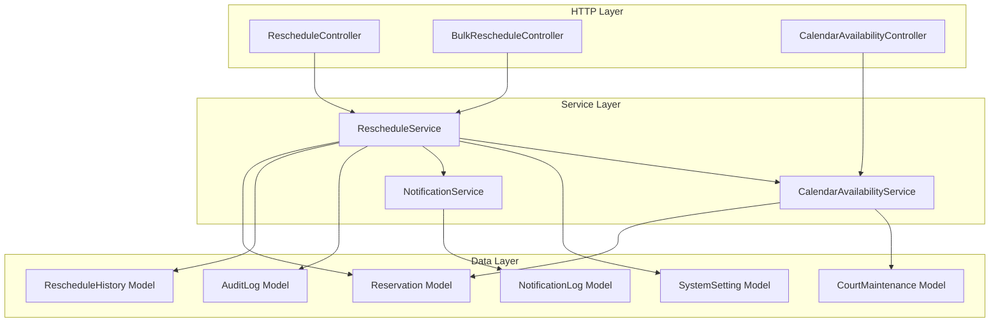
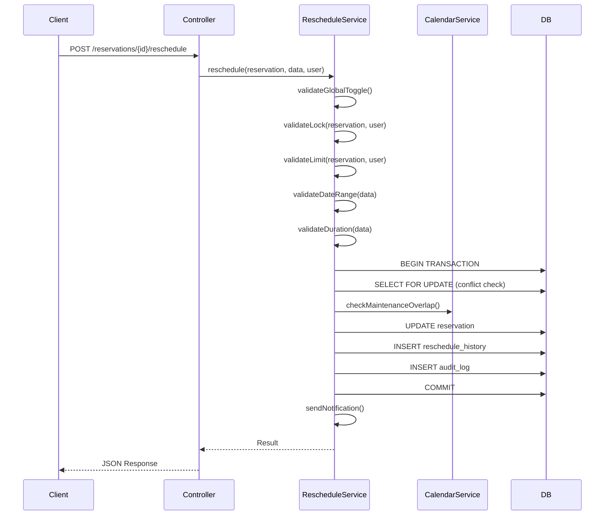

# Design Document: Booking Reschedule

## Overview

This design describes the technical architecture for the booking reschedule feature in the Pickleball court management system. The feature enables administrators to globally control rescheduling, lock/unlock individual reservations, bulk-initiate reschedules for time ranges (e.g., due to weather), and allows clients to select new time slots from a calendar view. The system enforces conflict detection with row-level locking, preserves all existing booking data through atomic transactions, tracks reschedule history, and enforces configurable reschedule limits.

The implementation extends the existing `RescheduleController` and introduces a new `RescheduleService` to encapsulate business logic, a `RescheduleHistory` model for audit tracking, and a `CalendarAvailabilityService` for slot computation. The design leverages existing infrastructure: `SystemSetting` for configuration, `NotificationService` for alerts, `AuditLog` for audit trails, and Laravel's database transactions with pessimistic locking for concurrency safety.

## Architecture



### Request Flow



## Components and Interfaces

### RescheduleService

The central service encapsulating all reschedule business logic. Extracted from the controller to enable testability and reuse across single and bulk reschedule flows.

```php
namespace App\Services;

class RescheduleService
{
    public function __construct(
        private NotificationService $notificationService,
        private CalendarAvailabilityService $calendarService,
    ) {}

    /**
     * Execute a reschedule for a single reservation.
     * Performs all validation, conflict detection, and atomic update.
     *
     * @throws \App\Exceptions\RescheduleException
     */
    public function reschedule(Reservation $reservation, array $data, User $actor): Reservation;

    /**
     * Bulk-initiate reschedule for multiple reservations.
     * Sets status to pending_reschedule and notifies owners.
     *
     * @param Collection<Reservation> $reservations
     * @return array{success: int, failed: int, errors: array}
     */
    public function bulkInitiateReschedule(Collection $reservations, User $actor): array;

    /**
     * Lock a reservation from client rescheduling.
     */
    public function lock(Reservation $reservation, User $actor): void;

    /**
     * Unlock a reservation for client rescheduling.
     */
    public function unlock(Reservation $reservation, User $actor): void;

    /**
     * Check if a user is allowed to reschedule a given reservation.
     * Validates global toggle, lock status, ownership, status, and limits.
     *
     * @throws \App\Exceptions\RescheduleException
     */
    public function validateRescheduleEligibility(Reservation $reservation, User $actor): void;

    /**
     * Validate the requested schedule data (date range, duration).
     *
     * @throws \Illuminate\Validation\ValidationException
     */
    public function validateScheduleData(array $data): array;

    /**
     * Check for booking conflicts on a court/date/time window.
     * Must be called within a transaction with row-level locking.
     *
     * @throws \App\Exceptions\RescheduleException
     */
    public function checkConflicts(int $courtId, string $date, string $startTime, string $endTime, int $excludeReservationId): void;

    /**
     * Check for maintenance window overlaps.
     *
     * @throws \App\Exceptions\RescheduleException
     */
    public function checkMaintenanceOverlap(int $courtId, string $date, string $startTime, string $endTime): void;
}
```

### CalendarAvailabilityService

Computes time slot availability for a given court and date.

```php
namespace App\Services;

class CalendarAvailabilityService
{
    /**
     * Get all 1-hour time slots for a court on a date with availability status.
     *
     * @param int|null $excludeReservationId Reservation to exclude from "booked" calculation
     * @return array<array{start_time: string, end_time: string, status: string}>
     */
    public function getSlots(int $courtId, string $date, ?int $excludeReservationId = null): array;

    /**
     * Check if a specific time window has any conflicts.
     */
    public function hasConflict(int $courtId, string $date, string $startTime, string $endTime, ?int $excludeReservationId = null): bool;

    /**
     * Check if a time window overlaps with maintenance.
     */
    public function hasMaintenanceOverlap(int $courtId, string $date, string $startTime, string $endTime): bool;
}
```

### RescheduleController (Updated)

The existing controller is refactored to delegate to `RescheduleService`. The lock/unlock methods are simplified to remove the reason requirement per Requirement 2.

```php
namespace App\Http\Controllers;

class RescheduleController extends Controller
{
    public function __construct(private RescheduleService $rescheduleService) {}

    public function lock(Reservation $reservation): JsonResponse;
    public function unlock(Reservation $reservation): JsonResponse;
    public function status(Reservation $reservation): JsonResponse;
    public function reschedule(Request $request, Reservation $reservation): JsonResponse;
    public function calendar(Request $request, Reservation $reservation): JsonResponse;
}
```

### BulkRescheduleController

New controller for admin bulk reschedule operations.

```php
namespace App\Http\Controllers;

class BulkRescheduleController extends Controller
{
    public function __construct(private RescheduleService $rescheduleService) {}

    /**
     * GET - Fetch reservations for a date/time range.
     */
    public function index(Request $request): JsonResponse;

    /**
     * POST - Initiate bulk reschedule for selected reservations.
     */
    public function store(Request $request): JsonResponse;
}
```

### RescheduleHistory Model

```php
namespace App\Models;

class RescheduleHistory extends Model
{
    protected $table = 'reschedule_histories';
    protected $guarded = [];

    protected $casts = [
        'original_date' => 'date',
        'new_date' => 'date',
        'rescheduled_at' => 'datetime',
    ];

    public function reservation(): BelongsTo;
    public function rescheduledBy(): BelongsTo;
}
```

### RescheduleException

Custom exception for reschedule-specific error handling.

```php
namespace App\Exceptions;

class RescheduleException extends \RuntimeException
{
    public static function globallyDisabled(): self;
    public static function locked(): self;
    public static function limitReached(int $current, int $max): self;
    public static function conflict(): self;
    public static function maintenanceOverlap(): self;
    public static function notPendingReschedule(): self;
    public static function notOwner(): self;
    public static function transactionFailed(): self;
}
```

## Data Models

### New Table: `reschedule_histories`

| Column | Type | Constraints |
|--------|------|-------------|
| id | bigint unsigned | PK, auto-increment |
| reservation_id | bigint unsigned | FK → reservations.id, NOT NULL |
| original_date | date | NOT NULL |
| original_start_time | time | NOT NULL |
| original_end_time | time | NOT NULL |
| new_date | date | NOT NULL |
| new_start_time | time | NOT NULL |
| new_end_time | time | NOT NULL |
| rescheduled_by | bigint unsigned | FK → users.id, NULL ON DELETE SET NULL |
| rescheduled_at | timestamp | NOT NULL |
| created_at | timestamp | DEFAULT CURRENT_TIMESTAMP |
| updated_at | timestamp | DEFAULT CURRENT_TIMESTAMP ON UPDATE |

**Indexes:**
- `reservation_id` (for counting reschedules per booking)
- `rescheduled_by` (for audit queries)

### New SystemSetting Records

| setting_key | setting_type | default | group_name |
|-------------|-------------|---------|------------|
| `reschedule_enabled` | boolean | false | reschedule |
| `max_reschedules_per_booking` | integer | 2 | reschedule |

### Reservation Model Changes

- Add `rescheduleHistories(): HasMany` relationship
- Add `pending_reschedule` to the status enum in the migration
- Change `reschedule_locked` default to `true` (already done in existing migration)
- Remove `reschedule_locked_reason` requirement from lock/unlock (simplify to single-click)

### Updated Status Enum

The `reservations.status` column gains a new value:

```
pending_payment | payment_verification | confirmed | checked_in | ongoing | completed | cancelled | no_show | refunded | pending_reschedule
```

### Route Additions

```php
// Bulk reschedule (Admin/Staff)
Route::get('/reschedule/bulk', [BulkRescheduleController::class, 'index'])
    ->name('reschedule.bulk.index');
Route::post('/reschedule/bulk', [BulkRescheduleController::class, 'store'])
    ->name('reschedule.bulk.store');

// Calendar availability for reschedule
Route::get('/reservations/{reservation}/reschedule/calendar', [RescheduleController::class, 'calendar'])
    ->name('reservations.reschedule.calendar');

// Global reschedule setting (Admin only)
Route::post('/settings/reschedule-toggle', [RescheduleController::class, 'toggleGlobal'])
    ->name('settings.reschedule.toggle');
```

## Correctness Properties

*A property is a characteristic or behavior that should hold true across all valid executions of a system — essentially, a formal statement about what the system should do. Properties serve as the bridge between human-readable specifications and machine-verifiable correctness guarantees.*

### Property 1: Global Setting Round-Trip

*For any* boolean value, setting `reschedule_enabled` via `SystemSetting::set()` and then retrieving it via `SystemSetting::value()` (after cache clear) should return the same boolean value.

**Validates: Requirements 1.1, 1.2**

### Property 2: Global Toggle Enforcement

*For any* client reschedule request and any reservation state, the request passes the global toggle check if and only if `SystemSetting::value('reschedule_enabled', false)` returns true.

**Validates: Requirements 1.3, 1.4, 1.5**

### Property 3: Non-Admin Cannot Update Global Setting

*For any* user without the `super_admin` or `admin` role, attempting to update the `reschedule_enabled` setting should be rejected with a 403 response, and the setting value should remain unchanged.

**Validates: Requirements 1.6**

### Property 4: Lock/Unlock Idempotence

*For any* reservation, applying the lock operation produces `reschedule_locked = true`, applying unlock produces `reschedule_locked = false`, and applying the same operation twice yields the same state as applying it once (idempotent).

**Validates: Requirements 2.1, 2.2, 2.6**

### Property 5: Lock Enforcement with Admin Bypass

*For any* reservation with `reschedule_locked = true` and any user, the reschedule lock check rejects the request if and only if the user has the `user` (end_user) role. Admin and Staff users are never blocked by the lock.

**Validates: Requirements 2.3, 2.4**

### Property 6: Bulk Reschedule Filter Correctness

*For any* date, start_time, end_time range, the set of reservations returned by the bulk filter query contains exactly those reservations where: (a) the reservation's time interval overlaps with the query interval on that date, AND (b) the reservation status is `confirmed` or `payment_verification`.

**Validates: Requirements 3.2, 3.8**

### Property 7: Bulk Reschedule Notification Dispatch

*For any* set of reservations transitioned to `pending_reschedule` via bulk action, exactly one notification is created per reservation owner, and each notification references the correct reservation.

**Validates: Requirements 3.5, 3.6**

### Property 8: Ownership Authorization

*For any* client user and any reservation where `reservation.user_id` does not equal the authenticated user's ID, the reschedule request is rejected.

**Validates: Requirements 4.2**

### Property 9: Status Precondition for Client Reschedule

*For any* reservation not in `pending_reschedule` status, a client-initiated reschedule selection is rejected.

**Validates: Requirements 4.3, 4.4**

### Property 10: Date Range Validation

*For any* requested reschedule date, the request is accepted only if the date is between today (inclusive) and today + 15 days (inclusive). Dates before today or more than 15 days out are rejected.

**Validates: Requirements 4.6, 4.7**

### Property 11: Duration Validation

*For any* requested start_time and end_time, the request is accepted only if the duration (end_time - start_time) is at minimum 60 minutes and at maximum 240 minutes.

**Validates: Requirements 4.8**

### Property 12: Conflict Detection Correctness

*For any* two reservations on the same court_id and reservation_date, where neither has status in (cancelled, no_show, refunded), a conflict exists if and only if `existing.start_time < requested.end_time AND existing.end_time > requested.start_time`. When a conflict is detected, the reschedule is rejected and the reservation remains unchanged.

**Validates: Requirements 5.1, 5.2, 5.3**

### Property 13: Maintenance Overlap Rejection

*For any* reschedule request where a `court_maintenance` record exists for the same court with `start_datetime < requested_end AND end_datetime > requested_start` (or `is_all_day = true` for that date), the request is rejected.

**Validates: Requirements 5.6**

### Property 14: Calendar Slot Classification

*For any* court, date, and set of active reservations and maintenance records, each generated 1-hour slot is classified as: "booked" if an active reservation (excluding the one being rescheduled) overlaps, "maintenance" if a court_maintenance record overlaps, or "available" otherwise.

**Validates: Requirements 6.1, 6.2, 6.3, 6.4**

### Property 15: Data Preservation on Reschedule

*For any* successful reschedule operation, all reservation fields except `reservation_date`, `start_time`, `end_time`, `status`, and `updated_at` remain identical to their pre-reschedule values. All associated payment, equipment, check-in, check-out, and cancellation records remain unchanged.

**Validates: Requirements 7.1, 7.2, 7.4**

### Property 16: Reschedule History and Audit Creation

*For any* successful reschedule, exactly one `RescheduleHistory` record is created with the correct original and new date/time values, and exactly one `AuditLog` record is created with action `reservation.rescheduled` containing the reservation_code and old/new schedule in its values.

**Validates: Requirements 7.3, 7.5**

### Property 17: Reschedule Limit Enforcement with Admin Bypass

*For any* reservation where the count of `RescheduleHistory` entries is greater than or equal to `max_reschedules_per_booking`, a client reschedule request is rejected. Admin and Staff users are never blocked by the limit, but a `RescheduleHistory` entry is still created for their reschedules.

**Validates: Requirements 9.2, 9.3, 9.5, 9.6**

## Error Handling

### Error Categories and Responses

| Error | HTTP Status | Response Message | Recovery |
|-------|-------------|-----------------|----------|
| Global reschedule disabled | 403 | "Rescheduling is currently disabled system-wide." | Admin enables setting |
| Reservation locked | 403 | "Rescheduling is locked for this reservation." | Admin unlocks |
| Not owner | 403 | "You can only reschedule your own reservations." | N/A |
| Not pending_reschedule | 422 | "This reservation is not awaiting reschedule." | Admin initiates |
| Date in past | 422 | "Reschedule date must be today or later." | Select valid date |
| Date too far | 422 | "Reschedule date must be within 15 days." | Select closer date |
| Invalid duration | 422 | "Duration must be between 1 and 4 hours." | Adjust times |
| Conflict detected | 409 | "The selected time slot is unavailable." | Select different slot |
| Maintenance overlap | 409 | "The selected time overlaps with scheduled maintenance." | Select different slot |
| Limit reached | 422 | "Reschedule limit reached ({count}/{max})." | Admin reschedules |
| Transaction failed | 500 | "Could not complete reschedule. Please try again." | Retry |
| Insufficient permissions | 403 | "You do not have permission to perform this action." | N/A |

### Transaction Failure Handling

The reschedule operation wraps conflict check + update + history + audit in a single `DB::transaction()` call with a retry count of 1 for deadlock scenarios. If the transaction fails:

1. All changes are rolled back automatically by Laravel's transaction manager
2. A `RescheduleException::transactionFailed()` is thrown
3. The controller catches it and returns a 500 response

### Notification Failure Handling

Notifications are dispatched **after** the transaction commits. If notification creation fails:

1. The exception is caught and logged via `Log::error()`
2. The reschedule remains committed (not reverted)
3. Admin can manually re-send notifications if needed

## Testing Strategy

### Property-Based Testing

This feature is well-suited for property-based testing because it contains pure validation logic, conflict detection algorithms, and state machine transitions that should hold universally across all valid inputs.

**Library:** [PHPUnit with `innmind/black-box`](https://github.com/Innmind/BlackBox) — a property-based testing library for PHP that integrates with PHPUnit.

**Configuration:**
- Minimum 100 iterations per property test
- Each test tagged with: `Feature: booking-reschedule, Property {N}: {title}`

**Property tests cover:**
- Validation logic (date range, duration, global toggle, lock enforcement)
- Conflict detection algorithm (time interval overlap)
- Calendar slot classification
- Data preservation invariants
- Limit enforcement logic
- Authorization checks

### Unit Tests (Example-Based)

Unit tests cover specific scenarios and edge cases:

- Default `reschedule_locked = true` on new reservations
- Notification content includes staff name for admin-initiated reschedules
- Notification metadata contains correct reschedule link URL
- "Check All" UI behavior (frontend test)
- Input format validation (date format, time format)
- Cache invalidation after setting update

### Integration Tests

Integration tests verify end-to-end flows with the database:

- Concurrent reschedule requests (race condition prevention)
- Full reschedule flow: initiate → select → confirm
- Bulk reschedule with notification dispatch
- Transaction atomicity (simulate failure mid-transaction)
- Row-level locking behavior under concurrent access

### Test File Structure

```
tests/
├── Unit/
│   └── Services/
│       ├── RescheduleServiceTest.php
│       ├── CalendarAvailabilityServiceTest.php
│       └── RescheduleValidationTest.php
├── Property/
│   └── Services/
│       ├── RescheduleConflictPropertyTest.php
│       ├── RescheduleValidationPropertyTest.php
│       ├── CalendarSlotPropertyTest.php
│       └── RescheduleDataPreservationPropertyTest.php
└── Feature/
    └── Http/
        ├── RescheduleControllerTest.php
        └── BulkRescheduleControllerTest.php
```
